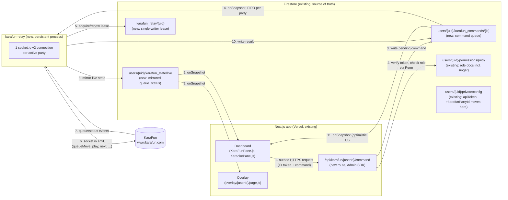

# KaraFun Relay: Design Doc

Status: **proposal, not implemented**. This document is for review before any code lands.

## 0. What's actually in the codebase (corrected)

An earlier version of this section claimed none of the control functions or the auto-sort feature
existed anywhere in this repo. **That was wrong** — it was researched against the wrong branch
(`main` before PR #28 merged). `origin/Beta` — now identical to `origin/main`, confirmed via
`git diff origin/main origin/Beta` returning empty — has real, working, previously-live code for
almost everything described. Corrected inventory, with real file/line references:

- **`src/hooks/useKaraFunData.js`** opens a real `socket.io-client` v2 connection to KaraFun and
  exposes real command functions — `addToQueue`, `moveInQueue`, `removeFromQueue`, `adjustPitch`,
  `adjustTempo`, `setVolume`, `setBackingVocalsVolume`, `setLeadVocalVolume`, `playSong`,
  `skipSong` (lines 288–306) — each a thin wrapper around a shared `emit(event, payload)` (line
  284). The wire protocol was reverse-engineered against KaraFun's own remote client and is
  documented in the code's own comments (referencing issue #27) — see §3.1's table below for the
  actual event names, which differ from the friendly JS function names.
- **`emit`'s only gate is `canControl`** (line 283): `isMasterAdmin || userRole === 'broadcaster'
  || userRole === 'mod' || userRole === 'singer'`. The code's own comment says this straight out
  (lines 269–282): *"every one of these functions is a raw, unauthenticated emit straight to
  KaraFun's real socket - there's no backend in between to check who's asking (see issue #29)...
  canControl is a client-side guard, not a real security boundary."* That's problem 1, already
  shipped, already self-diagnosed in the codebase, tracked as issue #29.
- **The hook is hoisted to `dashboard/page.js:269`**, called *once*, unconditionally, for every
  session with verified access (`chatEnabled = hasVerifiedAccess && !verifyingMod`, line 261) —
  not just broadcaster/mod. Since `hasVerifiedAccess` includes `userRole === 'singer'` (line 103)
  and the karaoke tab is open to every role once `karaokeEnabled` is on (line 286: *"Open to every
  role... viewers and singers are exactly who this tab is for"*), this means **any signed-in
  viewer's dashboard tab opens a live socket to KaraFun** the moment `karafunEnabled` + a party ID
  are set — not only mods with the KaraFun pane open. More simultaneous direct connections per
  broadcaster than the original problem description implied, not fewer.
- **`src/components/dashboard-shell/KaraFunPane.js`** (the mod-facing "KaraFun Mod" tab) has the
  actual disable history. Line 134's comment reads verbatim:

  > `DISABLED AGAIN (2026-09-05, second incident): still swapped two songs every ~5s against a
  > real party even after the v2 rewrite above.`

  It names two live, unruled-out suspects (lines 140–147): *"(a) more than one mod session had
  'KaraFun Mod' open at once, each independently polling and reconciling the same live queue
  against its own view of it, fighting each other... (b) presence for a participating singer
  flickering across the 90s online threshold... which would make nameFor/ownerIndexOf
  intermittently fail to match."* It also already names the fix direction: *"likely a per-target
  lock/lease (only one session acts) and/or requiring a discrepancy to persist across 2+
  consecutive ticks."* That's problem 2 — a documented incident, not a hypothetical.
- **A working `singer` role already exists** — `permissions/{uid}.role == 'singer'` plus a
  `participating` boolean (`firestore.rules`'s `isParticipatingSinger`), a `karaoke_requests`
  collection (song requests, duet invites, claiming), and `src/components/dashboard-shell/
  KaraokePane.js` gives singers real self-service actions: self-add, accept/decline, duet
  invites, a participation toggle, and — while it's their turn (`isMyTurn`, gated in the UI, *not*
  in `canControl`) — the same `playSong`/`skipSong`/`adjustPitch`/`adjustTempo`/`setVolume`/etc.
  calls KaraFunPane uses. The role question §3.3 previously flagged as "not decided yet" was
  already decided and shipped.
- **`src/app/overlay/[userId]/page.js`** is unchanged from what was previously documented — it
  still opens its own separate, unauthenticated, read-only KaraFun connection (lines ~184–249),
  reading the public `settings.karafunPartyId`, purely for display. This part of the original
  design holds.
- **`searchKaraFunSongs`** (`useKaraFunData.js` lines 12–17) is a separate, unauthenticated,
  read-only `fetch` straight to KaraFun's public search endpoint, used to populate the "Search
  Songs" panel in `KaraokePane.js`. No state mutation, no race — out of scope for this relay,
  stays exactly as it is.

Net effect on this doc: the architecture (relay, command queue, lease, state mirroring) doesn't
change — it was already designed generically enough to fit real code once found. What changes is
everything that depended on *not knowing* the real command protocol, the real disabled algorithm,
and the real (and more permissive than assumed) role model. Those sections are corrected below.

## 1. Why a relay, and why not routes-only

Firestore is the app's only backend and its only realtime transport (dashboard ↔ overlay both use
`onSnapshot`; see CLAUDE.md). Firestore is not a substitute for a live socket.io session with a
third party, though: KaraFun requires a persistent, authenticated per-party socket.io v2
connection, and multiple independent sockets issuing conflicting `queueMove` calls against the
same party is exactly the race that already happened twice (§0). A plain Next.js API route
(Vercel serverless function) can't hold that connection open across requests — it's stateless
request/response, and Vercel functions get torn down between invocations.

So the fix has two parts that need to be separated:

1. **Authorization** (who is allowed to send which command) — this belongs in front of the
   relay, checked per-request, using the same Firebase Auth + `permissions/{uid}` model the rest
   of the app already uses. This can and should stay in Next.js API routes, because that's
   already where `firebase-admin` credentials and role logic live (see
   `src/app/api/overlay/[userId]/route.js`). This is what closes issue #29.
2. **Single ownership of the live KaraFun socket** — this needs a process that stays up between
   requests. That's the actual "relay": one small persistent Node service, one real socket.io
   connection per actively-used party, everyone else talks to it indirectly. This is what fixes
   the auto-sort incident from §0 for real, per its own disable comment's diagnosis.

## 2. Architecture overview



Key shift from today: **KaraFun state (queue/status) becomes relay-owned and Firestore-mirrored,
not directly fetched by either client.** This is the same trick the app already uses everywhere
else (Firestore as the sync layer between dashboard and overlay) — it's not a new pattern, it's
applying the existing one to the one place that still bypasses it (and, per §0, the place with the
most simultaneous direct connections per broadcaster, not the fewest). It also directly answers
"how does the overlay's connection fit in": it stops connecting to KaraFun at all and just reads
`users/{uid}/karafun_state/live` via `onSnapshot`, exactly like it already reads `settings/config`
and `active_message/current`.

## 3. Data flow, in detail

### 3.1 Commands

Actual wire protocol, from `useKaraFunData.js`'s `emit` calls (verified live against KaraFun's own
remote client per issue #27 — not assumed):

| JS function | KaraFun event | Payload |
|---|---|---|
| `addToQueue(songId, singer, pos)` | `queueAdd` | `{ songId, pos, singer }` |
| `moveInQueue(queueId, from, to)` | `queueMove` | `{ queueId, from, to }` |
| `removeFromQueue(queueId)` | `queueRemove` | `queueId` |
| `adjustPitch(delta)` | `pitch` | `delta` (relative step, not absolute) |
| `adjustTempo(delta)` | `tempo` | `delta` (relative step, not absolute) |
| `setVolume(value)` | `volume` | `value` |
| `setBackingVocalsVolume(value)` | `volumeBv` | `value` |
| `setLeadVocalVolume(filename, value)` | `volumeLd` | `{ filename, volume }` |
| `playSong()` | `play` | `null` |
| `skipSong()` | `next` | `null` |

Flow:

1. Dashboard calls `POST /api/karafun/[userId]/command` with a Firebase ID token
   (`Authorization: Bearer <token>`) and a body naming the JS-level action (e.g.
   `{ action: 'moveInQueue', queueId, from, to }`) — the route, not the client, maps that to the
   real wire event via the table above, so a client can never smuggle a raw KaraFun event through.
2. The route verifies the token with `getAdminAuth().verifyIdToken()`, then re-derives the
   caller's role against `userId` the same way `dashboard/page.js` does client-side today —
   mirrored server-side, not trusted from the client:
   - `uid === userId` → broadcaster.
   - else read `users/{userId}/permissions/{uid}`; role field → `mod` / `singer` / whatever's
     stored (mirroring `isChannelModerator`/`isParticipatingSinger` in `firestore.rules`, which
     now check the `role` field explicitly, not just doc existence — a `singer` or `denied` doc
     existing is not proof of mod access, unlike the old comment this doc previously quoted).
   - missing permissions doc → `viewer`.
   - master admin claim (`token.isMasterAdmin`) bypasses, same as `isMasterAdmin()` in the rules.
3. Route checks the resolved role **and, for turn/ownership-scoped actions, the actual song/turn
   state** against the authorization matrix (§3.3) — this is the real gap versus today's client
   code: `canControl` only checks role, so today a `singer` who opened devtools could call
   `karaFun.moveInQueue()` on someone else's entry or `karaFun.playSong()` outside their own turn,
   even though the UI never exposes a path to do either. The route is what actually closes that,
   not just moving the same coarse check server-side.
4. Route writes `users/{userId}/karafun_commands/{autoId}`:
   ```js
   { action, params, requestedBy: uid, requestedByRole: role, status: 'pending', createdAt: serverTimestamp() }
   ```
5. The relay holds one `onSnapshot` per actively-connected party on
   `users/{userId}/karafun_commands` where `status == 'pending'`, ordered by `createdAt`.
   Processing them one at a time, in the order they arrive, on the single process that owns the
   party's socket **is** the fix for the auto-sort incident's suspect (a) from §0 — there is
   structurally only one writer of `queueMove` regardless of how many dashboard tabs/mods/singers
   have a socket-worthy session open, because none of them talk to KaraFun directly anymore.
6. Relay executes the corresponding KaraFun socket.io emit, waits for KaraFun's ack/next
   `queue`/`status` event (with a timeout), and updates the command doc: `status: 'done'` or
   `status: 'failed', error`.
7. Dashboard optionally listens on that one command doc (`onSnapshot`) to show inline
   success/failure instead of assuming success — cheap, since it's already paying for a Firestore
   listener per open pane.

Firestore write cost here is one small doc per command, comparable to what `active_message`
already does per chat send — not a new order of magnitude for this app.

### 3.2 State mirroring (reads: queue display, now-playing display)

Relay keeps the existing `queue`/`status` socket.io listeners (same shape as `useKaraFunData.js`'s
current `socket.on('queue', ...)` / `socket.on('status', ...)` handlers) but instead of `setState`
in a React hook, it writes the transformed result into `users/{userId}/karafun_state/live` on
every event, debounced/coalesced (e.g. max 1 write/500ms) since KaraFun can emit `queue` faster
than Firestore write quotas or the UI actually needs. Dashboard and overlay both drop their own
`io(...)` calls and instead `onSnapshot` that one doc — collapsing what's currently up to three
simultaneous direct sockets per broadcaster (every verified dashboard session per §0, plus the
overlay) down to exactly one (the relay's).

### 3.3 Authorization matrix

| Action | broadcaster | mod | singer | viewer |
|---|---|---|---|---|
| view queue/now playing (read `karafun_state`) | yes (public, existing) | yes | yes | yes |
| `playSong` / `skipSong` | yes | yes | **only while it's their turn** (`isMyTurn`, same check `KaraokePane.js` already renders on) | no |
| `moveInQueue` (reorder any entry) | yes | yes | no | no |
| remove/reorder **own** queued song | yes | yes | yes (`queueId` must belong to an entry the requester's own `singer` name owns) | no |
| `adjustPitch` / `adjustTempo` / `setVolume` / `setBackingVocalsVolume` / `setLeadVocalVolume` | yes | yes | **only while it's their turn**, same as play/skip | no |
| `addToQueue` (self-add / accept / duet) | yes | yes | yes, via the existing `karaoke_requests` flow (unchanged — already server-enforced by `firestore.rules`, not part of this relay) | no (already true today) |
| toggle auto-sort on/off | yes | no | no | no |

This is stricter than today's actual client-side `canControl`, which is role-only (§0) — the route
is where turn/ownership scoping actually gets enforced for the first time, matching what the UI
already implies but never backed with a real check. `viewer` stays `no` across the board:
`ROLE_TABS`/`dashboard/page.js` never gives a viewer a path to any of these functions through the
app's own UI, and the karaoke-request self-service actions viewers *do* have (submitting a
request) are a separate, already-rules-enforced Firestore write, not a relay command.

## 4. Party lock / single-authority lease

Even with the relay design, a lease is worth having, for two reasons beyond what already happened:
(a) a rolling deploy of the relay can briefly run old+new instance together, and (b) if the relay
is ever scaled beyond one instance (e.g. by someone changing a `max-instances` setting without
reading this doc), the lease is what stops two relay processes from opening two sockets to the
same party — i.e. it's the concrete fix for suspect (a) in the real "DISABLED AGAIN" comment
(§0): *"more than one mod session had 'KaraFun Mod' open at once, each independently polling and
reconciling."* Once nothing but the relay ever holds a socket, "more than one session" can only
mean "more than one relay instance," which the lease directly prevents.

Design: `karafun_relay/{userId}` doc holding `{ instanceId, partyId, leaseExpiresAt }`. Before
opening a socket for a party, the relay does a Firestore transaction: read the doc, and only
proceed if it's missing, expired, or already owned by `instanceId` (its own restart). It renews
the lease (`leaseExpiresAt = now + 30s`, say) every 10s while the socket is open, and deletes the
doc on clean shutdown. A second instance that loses the transaction simply doesn't open a socket
for that party and retries later. This is the same optimistic-lock shape as the existing
`toggle-karafun-queue` transaction in `api/overlay/[userId]/route.js` — nothing new
conceptually, just applied to "who owns this socket" instead of "who owns this boolean."

**Multi-tenancy:** the relay is one process serving every broadcaster, not one process per
broadcaster. It holds a separate socket.io connection **per party**, keyed by `userId` (the lease
doc is `karafun_relay/{userId}`, one per broadcaster) — so if two different streamers each have
their own KaraFun party running at the same time, that's two independent sockets inside the same
relay process, each with its own `partyId`, its own command queue (`users/{userId}/karafun_commands`),
its own lease, and its own mirrored state doc (`users/{userId}/karafun_state/live`). They never
share a socket or a queue — nothing about processing one party's commands blocks or interacts
with another party's.

Connection lifecycle, per party: open a party's socket lazily on its first pending command or
first active `karafun_state` subscriber signal, keep it open while `karafunEnabled` is true and
the lease is held, and close it after some idle window (e.g. no commands and no read subscribers
for 10 minutes) to avoid holding sockets open for broadcasters who aren't live. Subscriber presence
can piggyback on the existing `online/{uid}` heartbeat doc (already written every 30s while a
dashboard is open) rather than inventing new presence tracking.

This per-party laziness is a separate axis from whether the relay **process itself** stays running
when literally nobody, across every broadcaster, is streaming — see §8.

## 5. Reintroducing auto-sort (round-robin) safely

The existing v2 algorithm in `KaraFunPane.js` (lines 97–229, currently dead behind a bare
`return;` at line 155) is already well-reasoned — round-robin by rotation round rather than a
static priority list, cursor derived from KaraFun's own live "who's actually singing" status
rather than a separately-tracked value, single move per tick recomputed fresh from the latest
server-reported queue (not a batch simulated locally), never targets whatever's currently playing
(confirmed unmovable in KaraFun's own remote client), and a real circuit breaker
(`stallCountRef`/`lastMoveSignatureRef`/`MAX_STALLED_ATTEMPTS = 3`) that stops retrying a move that
keeps getting proposed without the live queue ever reflecting it. This isn't being redesigned —
it's being **relocated**:

- Move the tick logic (currently a client-side `setInterval` in a React component) into the relay,
  running once per party it holds a lease for, on the same 5s interval.
- Feed it the relay's own in-memory view of the queue (from the `queue`/`status` socket listeners
  already needed for §3.2) instead of a `liveRef` populated by React effects, and issue its moves
  through the same command-queue path as manually-issued commands (§3.1) — a manual mod reorder and
  an auto-sort pass become two producers into the same FIFO queue on one consumer, never two
  sockets racing each other.
- Keep the exact same circuit breaker logic and thresholds — they were reasoned out against a real
  incident and don't depend on where the code runs.
- Being relay-hosted with a lease is what actually addresses the disable comment's own two named
  suspects (§0/§4): suspect (a), multiple independent pollers, becomes structurally impossible
  (one relay instance, one lease, one poller per party); suspect (b), presence flicker on the
  90s online threshold causing `nameFor`/`ownerIndexOf` mismatches, still needs its own fix
  (e.g. requiring a discrepancy to persist across 2+ consecutive ticks before acting on it, exactly
  as the disable comment itself suggests) — moving the code doesn't fix that half on its own, so
  carry that specific change over when porting the logic, not just the file location.
- Surface *why* it tripped (last error, from `karafun_relay/{userId}`'s own state or a
  `karafunAutoSortDisabled: true` + reason flip on `users/{userId}/settings/config`) somewhere the
  broadcaster can actually see it on the dashboard — today it just silently sits disabled with only
  a code comment explaining why.
- Ship it **off by default even after being ported**, opt-in per broadcaster, only after the plain
  manual command path (§3.1) has been used for real — see §9.

## 6. Firestore rules changes

```
match /karafun_state/{document=**} {
  allow read: if true;                 // overlay still needs this, unauthenticated
  allow write: if false;               // Admin SDK only (relay bypasses rules)
}

match /karafun_commands/{commandId} {
  allow read: if isChannelModerator(userId);   // for the optimistic-UI listener in 3.1
  allow write: if false;               // API route (Admin SDK) is the only writer
}
```

`karafun_relay/{userId}` (top-level, not under `users/{userId}`) needs no client rule at all if
only the relay (Admin SDK) and nothing client-side ever touches it — default-deny is correct.

`karafunPartyId`: once the relay is the only thing that dials KaraFun directly, neither dashboard
nor overlay clients need to read it anymore (dashboard already only *writes* it via
`handleSavePartyId`; overlay currently reads it purely to open its own socket, which goes away in
this design — `KaraokePane.js`'s `searchKaraFunSongs(partyId, ...)` also reads it client-side today
for the public search endpoint, and needs to keep doing so, since that call stays direct per §0 —
so the dashboard side specifically still needs read access even after the move, just not the
overlay). So it moves from `settings/config` (public read) to `private/config` (owner-only
read/write, same doc that already holds `apiToken`) — the overlay no longer needs it once §7's
cutover ships; the dashboard still reads it from `private/config`, which it already has access to
as the signed-in owner.

No change needed to the existing `settings/config` carve-out that lets a mod update just
`karaokeRotationOrder` (rules lines 88–96) — that's a separate, already-correct mechanism (the
*display* rotation order mods manually reorder) distinct from KaraFun's own live queue order that
`moveInQueue`/auto-sort actually manipulates; the relay doesn't need to touch it.

## 7. `useKaraFunData.js` / `KaraFunPane.js` / `KaraokePane.js` changes

- **`useKaraFunData.js`**: stays hoisted once at `dashboard/page.js:269` (that hoisting was already
  correct — one shared connection instead of each pane reconnecting independently, per its own
  comment at lines 264–268). Delete the `io(...)` block and its `connect`/`queue`/`status`/etc.
  handlers. Replace with a single `onSnapshot` on `users/{targetUid}/karafun_state/live`, mapped
  into the same `queueData` shape both panes already consume, so neither pane's rendering needs to
  change. Replace the direct `emit()`-based command functions with a single `sendCommand(action,
  params)` that `POST`s to `/api/karafun/[userId]/command` with the current user's ID token
  (`auth.currentUser.getIdToken()`) — every existing call site (`moveInQueue(...)`,
  `playSong()`, etc.) keeps its current name and signature, just backed by the route instead of a
  raw socket emit, so `KaraFunPane.js`/`KaraokePane.js` need minimal changes beyond that. Drop the
  client-side `canControl` gate entirely — it becomes dead weight once the real check lives
  server-side; keep the client-side role-based hiding of controls that's already there for UX
  (e.g. `isMyTurn` gating which buttons render), just don't treat it as security anymore since it
  never actually was. `handleSavePartyId` keeps writing Firestore directly (still a plain
  owner-only settings write), just now to `private/config` instead of `settings/config` per §6.
  `searchKaraFunSongs` is unchanged — stays a direct client-side fetch, per §0/§6.
- **`KaraFunPane.js`**: no new controls needed — Play/Pause, Skip, per-entry remove, and manual
  Rotation Order reorder already exist and already call the right functions; they just start
  going through the relay transparently once `useKaraFunData.js` changes underneath them. Delete
  the dead auto-sort `useEffect` (lines 97–229) — that logic moves into the relay per §5, not
  into this component anymore.
- **`KaraokePane.js`**: same story — its turn-based play/skip/pitch/tempo/volume controls and
  queue-remove button already exist and already call the same `karaFun.*` functions; no new UI
  needed, just the same underlying swap.
- **`overlay/[userId]/page.js`**: delete its own `io(...)` block, replace with `onSnapshot` on the
  same `karafun_state/live` doc. No more `karafunPartyId` read needed there at all.

## 8. Where the relay runs

Vercel (the Next.js app's implied host, given `next.config.mjs`/CLAUDE.md's serverless framing)
doesn't support long-lived outbound socket.io connections in its function runtime, so this has to
be a separate deployment, not a route.

**Code lives in this repo**, as `relay/` — its own `package.json`/`node_modules`, same pattern
`functions/` already establishes for a subdirectory with a different runtime/deploy target than the
Next.js app. Rationale: this repo is what anyone self-hosting StreamCast Pro clones, and the relay
isn't optional infrastructure for them the way, say, a CI workflow is — if they want KaraFun
control features at all, they need the relay too, so it travels with the app rather than living in
a separate repo only the original deployer knows to go find. Dokploy deploys it straight from that
subdirectory of this repo (same repo, same branch, different build path than the Next.js app).

**Decision: self-hosted Dokploy, always-on container, on the existing 8 vCPU / 16GB RAM / 400GB
SSD box.** Confirmed against that box's actual Dokploy usage graphs (not just theoretical specs):
1.86% CPU used, 8.98GiB/16GiB RAM used (~7GB free), 57GB/394GB disk used. The relay's realistic
footprint — a Node process holding a handful of socket.io connections, maybe 50-150MB RAM, close
to zero sustained CPU — is a rounding error against ~7GB of free RAM and 8 essentially-idle vCores.
No capacity concern.

Deployment shape: a plain Docker container running the relay's persistent Node process, deployed
from the repo the same way anything else on that Dokploy instance is, Traefik giving it HTTPS for
free. Because it's infrastructure already paid for, there's no per-vCPU-second/per-request meter
running, so the scale-to-zero machinery a serverless host would need (wake-on-HTTP-request, cold
starts, a `/connect/{userId}` wake endpoint) isn't needed at all — the process just stays up
continuously. The per-party *KaraFun* socket still opens/closes lazily around individual streams
exactly as described in §4 — that's about not holding pointless connections open against KaraFun's
servers, unrelated to hosting cost, so it stays regardless of host. Firebase Admin credentials are
the same `FIREBASE_PROJECT_ID`/`FIREBASE_CLIENT_EMAIL`/`FIREBASE_PRIVATE_KEY` triple
`firebase-admin.js` already handles for Vercel, just set as env vars in Dokploy's dashboard instead
— no new credential-handling risk, it's the same pattern already proven to work for the main app.
Two things worth confirming once the container's actually deployed rather than assumed: Dokploy's
restart policy brings it back up automatically after a host reboot or a process crash, and the
Docker disk usage graph (currently 24.78GB of images/containers/volumes) has room for one more
small image — it clearly does, but worth a glance after the first deploy.

Cloud Run (v2, scaled to zero) or a Fly.io/Render "auto stop/start" machine remain fine fallbacks
*only* if there's ever a reason to want this isolated from that box specifically — e.g. wanting the
relay's uptime independent of whatever else runs there, or the box's own resource picture changing
materially from what's confirmed above. Nothing in the current picture calls for that.

### 8.1 Anything else that should move to Dokploy while we're at it?

Went through the rest of the architecture (per CLAUDE.md) looking for other pieces with the same
"needs a persistent process, not a stateless request" shape that got this relay off of serverless.
Short answer: no — nothing else in this app currently has that shape, so nothing else is a forced
move the way the relay is. For the record, what was checked and why it stays put:

- **The Twitch chat connection (`tmi.js`, dashboard, client-side)** looks superficially similar
  (many clients, one external realtime service) but isn't the same problem: each browser tab
  connects to Twitch chat *as that signed-in user*, read-only, with their own OAuth-scoped session
  — there's no shared mutable state multiple tabs could race over, the way multiple sessions racing
  `queueMove` calls on one shared KaraFun party actually was (§0). Moving chat behind a relay would
  trade a working per-user model for a shared one with no corresponding problem to fix. Leave it.
- **`src/app/api/overlay/[userId]/route.js`** (the existing remote-control HTTP API) and the new
  `/api/karafun/[userId]/command` route (§3.1) are both single-request, single-Firestore-write
  operations with no need to hold a connection open — exactly what Vercel functions are for. No
  reason to move.
- **Cloud Functions (`functions/index.js`, `notifyNewSignup`)** — event-triggered, short-lived,
  fires once per new signup. Serverless-appropriate as-is. Separately, CLAUDE.md already flags that
  it overlaps with `src/app/api/notify-signup/route.js` (both post the same Discord notification,
  one Firestore-triggered, one client-triggered) — that's worth deduplicating at some point, and
  *if* that consolidation ever happens, a single always-on Dokploy-hosted Firestore listener would
  be a clean place to put the one surviving implementation instead of two. But that's a separate
  cleanup from this relay work, not something this rewrite should pull in.
- **`scripts/cleanup-history.js`** (nightly Firestore purge, run via GitHub Actions cron per
  `.github/workflows/cleanup-history.yml`) — a scheduled batch job, not a persistent connection.
  GitHub Actions cron already does this for free with no maintenance burden; moving it to Dokploy
  would just mean managing one more cron schedule and one more copy of Firebase Admin credentials
  for no functional gain. Not worth it.

So: this relay is the one piece of the app that actually needed what Dokploy uniquely offers here
(a place to keep a socket open). Nothing else currently does.

## 9. Implementation plan

Given a very limited beta (a couple of known users), this is one build, not a staged rollout — see
the reasoning in the earlier revision of this section (there's no meaningful blast radius to manage
between shipping pieces separately at this scale).

**Build together, ship once:** the relay (state mirroring + command queue processing + the ported
auto-sort *logic*, dormant), the `/api/karafun/[userId]/command` route with the real role/turn/
ownership checks (§3.3), the `karafun_relay/{userId}` lease (§4), the `useKaraFunData.js`/
`KaraFunPane.js`/`KaraokePane.js`/overlay changes (§7), and moving `karafunPartyId` to
`private/config` (§6). These only make sense as one working system.

**The one real gate: auto-sort stays behind its own switch, off by default, until after the manual
path has actually been used.** Not about rollout caution — about not handing an autonomous feature
the controls before the plumbing under it (relay, lease, role checks) has been exercised for real,
and before suspect (b) from §0/§5 (presence-flicker mismatches) gets its own persistence-check fix
ported over, not just the relocation. Turn it on only after a few real sessions of plain manual
commands (skip/reorder/etc.) have gone fine.
