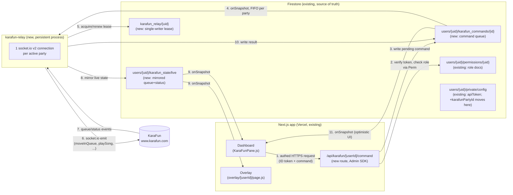

# KaraFun Relay: Design Doc

Status: **proposal, not implemented**. This document is for review before any code lands.

## 0. Correcting the premise

The task that prompted this doc described two "already happening" problems: unauthorized
playback-control functions (`playSong`, `skipSong`, `moveInQueue`, `adjustPitch`, `adjustTempo`,
`setVolume`, `setBackingVocalsVolume`, `setLeadVocalVolume`) live on the dashboard, and an
auto-sort/round-robin feature in `KaraFunPane.js` that had been disabled twice after a live
incident, with an existing "DISABLED AGAIN" comment and circuit-breaker sketch.

**Neither exists in this repository.** I grepped the working tree and full git history
(`git log --all -p`) for `DISABLED AGAIN`, `round.?robin`, `playSong`, `skipSong`, `moveInQueue`,
etc. — zero hits, on `main` and on this branch. The actual current state:

- `src/hooks/useKaraFunData.js` opens a client-side `socket.io-client` v2 connection to KaraFun
  and only ever emits `authenticate` (the handshake). It listens for `queue` and `status` and
  exposes Firestore-write helpers (`handleSavePartyId`, `handleToggleSetting`,
  `handleShowNowPlaying`, `handleHideNowPlaying`) — no playback-control function of any kind.
- `src/components/dashboard-shell/KaraFunPane.js` renders a read-only "now playing" + upcoming
  queue list and a settings panel (Party ID, overlay theme, position sliders). No reorder/skip/
  pitch/tempo/volume controls, no round-robin logic, no circuit breaker.
- `src/app/overlay/[userId]/page.js` opens its own, separate, equally read-only KaraFun
  connection to render the overlay widgets. It never emits a command either.

So today's integration is **display-only on both surfaces**, each holding its own direct
socket to `https://www.karafun.com`. The "two problems" in the task are accurately described as
the *risk this architecture creates the moment control functions get added* — not as bugs
already shipped and reverted. I'm treating this as a **greenfield control-plane design**: how to
add playback control safely from day one, rather than "re-enable disabled code." I've kept the
round-robin/circuit-breaker shape close to what the task described, since it's a reasonable
design regardless of whether prior code existed.

If there *is* a `playSong`/auto-sort branch elsewhere (a different fork, an uncommitted local
change, a different repo) that this session doesn't have access to, let me know and I'll revise
this against the real code instead of the read-only baseline above.

## 1. Why a relay, and why not routes-only

Firestore is the app's only backend and its only realtime transport (dashboard ↔ overlay both use
`onSnapshot`; see CLAUDE.md). Firestore is not a substitute for a live socket.io session with a
third party, though: KaraFun requires a persistent, authenticated per-party socket.io v2
connection, and multiple independent sockets issuing conflicting `moveInQueue` calls against the
same party is exactly the race the task is worried about. A plain Next.js API route (Vercel
serverless function) can't hold that connection open across requests — it's stateless
request/response, and Vercel functions get torn down between invocations.

So the fix has two parts that need to be separated:

1. **Authorization** (who is allowed to send which command) — this belongs in front of the
   relay, checked per-request, using the same Firebase Auth + `permissions/{uid}` model the rest
   of the app already uses. This can and should stay in Next.js API routes, because that's
   already where `firebase-admin` credentials and role logic live (see
   `src/app/api/overlay/[userId]/route.js`).
2. **Single ownership of the live KaraFun socket** — this needs a process that stays up between
   requests. That's the actual "relay": one small persistent Node service, one real socket.io
   connection per actively-used party, everyone else talks to it indirectly.

## 2. Architecture overview



Key shift from today: **KaraFun state (queue/status) becomes relay-owned and Firestore-mirrored,
not directly fetched by either client.** This is the same trick the app already uses everywhere
else (Firestore as the sync layer between dashboard and overlay) — it's not a new pattern, it's
applying the existing one to the one place that still bypasses it. It also directly answers "how
does the overlay's connection fit in": it stops connecting to KaraFun at all and just reads
`users/{uid}/karafun_state/live` via `onSnapshot`, exactly like it already reads `settings/config`
and `active_message/current`.

## 3. Data flow, in detail

### 3.1 Commands (writes: moveInQueue, playSong, skipSong, adjustPitch, adjustTempo, setVolume,
setBackingVocalsVolume, setLeadVocalVolume)

1. Dashboard calls `POST /api/karafun/[userId]/command` with a Firebase ID token
   (`Authorization: Bearer <token>`) and a body like `{ action: 'moveInQueue', queueId, toIndex }`.
2. The route verifies the token with `getAdminAuth().verifyIdToken()`, then re-derives the
   caller's role against `userId` the same way `dashboard/page.js` does client-side today —
   mirrored server-side, not trusted from the client:
   - `uid === userId` → broadcaster.
   - else read `users/{userId}/permissions/{uid}`; missing doc → `viewer` (matches the
     `isChannelModerator` comment's "existence alone is proof of invite" contract in
     `firestore.rules`); `role` field → `mod`/`broadcaster`/whatever's stored.
   - master admin claim (`token.isMasterAdmin`) bypasses, same as `isMasterAdmin()` in the rules.
3. Route checks the resolved role against an **authorization matrix** for the requested action
   (see §3.3) and rejects with 403 if not allowed. This is the actual fix for problem 1 — today
   `useKaraFunData` is invoked unconditionally for every signed-in role with zero server check;
   after this change, the socket itself would move behind the relay so even a compromised/rogue
   client can't reach KaraFun directly at all, but the route-level check exists too so the relay
   doesn't have to re-implement Firestore role logic.
4. Route writes `users/{userId}/karafun_commands/{autoId}`:
   ```js
   { action, params, requestedBy: uid, requestedByRole: role, status: 'pending', createdAt: serverTimestamp() }
   ```
5. The relay holds one `onSnapshot` per actively-connected party on
   `users/{userId}/karafun_commands` where `status == 'pending'`, ordered by `createdAt`.
   Processing them one at a time, in the order they arrive, on the single process that owns the
   party's socket **is** the fix for problem 2 — there is structurally only one writer of
   `moveInQueue` regardless of how many dashboard tabs/mods are open, because they no longer talk
   to KaraFun themselves.
6. Relay executes the corresponding KaraFun socket.io emit, waits for KaraFun's ack/next
   `queue`/`status` event (with a timeout), and updates the command doc: `status: 'done'` or
   `status: 'failed', error`.
7. Dashboard optionally listens on that one command doc (`onSnapshot`) to show inline
   success/failure instead of assuming success — cheap, since it's already paying for a Firestore
   listener per open pane.

Firestore write cost here is one small doc per command, comparable to what `active_message`
already does per chat send — not a new order of magnitude for this app.

### 3.2 State mirroring (reads: queue display, now-playing display)

Relay keeps the existing `queue`/`status` socket.io listeners (same shape as
`useKaraFunData.js` lines 147–193 today) but instead of `setState` in a React hook, it writes the
transformed result into `users/{userId}/karafun_state/live` on every event, debounced/coalesced
(e.g. max 1 write/500ms) since KaraFun can emit `queue` faster than Firestore write quotas or the
UI actually needs. Dashboard and overlay both drop their own `io(...)` calls and instead
`onSnapshot` that one doc — this removes two of the three current sockets per broadcaster (dashboard
tab, overlay tab) and leaves exactly one (the relay's).

### 3.3 Authorization matrix (proposed)

| Action | broadcaster | mod | singer | viewer |
|---|---|---|---|---|
| view queue/now playing (read `karafun_state`) | yes (public, existing) | yes | yes | yes |
| `playSong` / `skipSong` | yes | yes | no | no |
| `moveInQueue` (reorder others) | yes | yes | no | no |
| remove/reorder **own** queued song | yes | yes | yes (own entries only) | no |
| `adjustPitch` / `adjustTempo` (their own song, while singing) | yes | yes | yes (own turn only) | no |
| `setVolume` / `setBackingVocalsVolume` / `setLeadVocalVolume` | yes | yes | no | no |
| toggle auto-sort on/off | yes | no | no | no |

"singer" isn't a role that exists in the codebase today (`ROLE_TABS` has
`broadcaster`/`mod`/`viewer`/`waiting`, and `permissions/{uid}.role` is only ever
`mod`/`broadcaster` per `isChannelModerator`'s own comment; anything else defaults to `viewer`).
If self-service (a viewer managing only their own queued song) is wanted, it needs an actual role
addition in `permissions/{uid}.role` and in `ROLE_TABS`/the dashboard's role-resolution effect —
flagging this as an open question rather than assuming it, since it's a real product decision
about who gets a "singer" upgrade and how (self-serve via chat command? mod-granted?).
The table above marks singer-only actions **no** by default unless that's confirmed as wanted;
shipping with everything except broadcaster/mod at "no" is the safe default and is what §6's
phased plan assumes for phase 1.

## 4. Party lock / single-authority lease

Even with the relay design, a lease is worth having, for two reasons that have nothing to do with
today's dashboard bug: (a) a rolling deploy of the relay can briefly run old+new instance
together, and (b) if the relay is ever scaled beyond one instance (e.g. by someone changing a
`max-instances` setting without reading this doc), the lease is what stops two relay processes
from opening two sockets to the same party.

Design: `karafun_relay/{userId}` doc holding `{ instanceId, partyId, leaseExpiresAt }`. Before
opening a socket for a party, the relay does a Firestore transaction: read the doc, and only
proceed if it's missing, expired, or already owned by `instanceId` (its own restart). It renews
the lease (`leaseExpiresAt = now + 30s`, say) every 10s while the socket is open, and deletes the
doc on clean shutdown. A second instance that loses the transaction simply doesn't open a socket
for that party and retries later. This is the same optimistic-lock shape as the existing
`toggle-karafun-queue` transaction in `api/overlay/[userId]/route.js` — nothing new
conceptually, just applied to "who owns this socket" instead of "who owns this boolean."

**Multi-tenancy:** the relay is one process serving every broadcaster, not one process per
broadcaster. It holds a separate socket.io connection **per party**, keyed by `userId` (the lease
doc is `karafun_relay/{userId}`, one per broadcaster) — so if two different streamers each have
their own KaraFun party running at the same time, that's two independent sockets inside the same
relay process, each with its own `partyId`, its own command queue (`users/{userId}/karafun_commands`),
its own lease, and its own mirrored state doc (`users/{userId}/karafun_state/live`). They never
share a socket or a queue — nothing about processing one party's commands blocks or interacts
with another party's. The relay only needs to scale (more instances, more memory) if the number of
*simultaneously live* parties gets large enough to matter; for this app's scale, one process
comfortably holding a handful of concurrent party sockets is enough for a long while.

Connection lifecycle, per party: open a party's socket lazily on its first pending command or
first active `karafun_state` subscriber signal, keep it open while `karafunEnabled` is true and
the lease is held, and close it after some idle window (e.g. no commands and no read subscribers
for 10 minutes) to avoid holding sockets open for broadcasters who aren't live. Subscriber presence
can piggyback on the existing `online/{uid}` heartbeat doc (already written every 30s while a
dashboard is open) rather than inventing new presence tracking.

This per-party laziness was already the plan even for an always-on process. But it's worth being
explicit that it's a *separate* axis from whether the relay **process itself** stays running when
literally nobody, across every broadcaster, is streaming — see §8, since the deployment choice
changes based on that.

## 5. Reintroducing auto-sort (round-robin) safely

Since there's no existing implementation to resurrect, this is a fresh design, kept close to what
the task described:

- Runs **inside the relay**, not in any client — it's just another "who sends `moveInQueue`"
  actor, and the whole point of the relay is that it's the only such actor.
- Triggered on every `queue` event from KaraFun (or on a short debounce after one), computes the
  round-robin-fair target order from the current queue's singer sequence, diffs it against
  KaraFun's actual order, and issues the minimum set of `moveInQueue` calls to converge —
  processed through the same single-writer path as manually-issued commands (§3.1), so a manual
  mod reorder and an auto-sort pass can never race each other; they're just two producers into the
  same FIFO queue on one consumer.
- Circuit breaker: track consecutive failed/rejected `moveInQueue` acks per party in-memory (or in
  `karafun_relay/{userId}`, e.g. `autoSortConsecutiveFailures`); after a small threshold (e.g. 3)
  within a short window, flip `karafunAutoSortDisabled: true` in `users/{userId}/settings/config`
  (broadcaster-visible, broadcaster-writable-only per existing rules) and stop attempting further
  auto-sort moves for that party until a broadcaster manually re-enables it from the dashboard.
  Surface *why* it tripped (last error) somewhere the broadcaster can see it — this is exactly the
  visibility the task implies was missing before ("switching songs around in rapid succession"
  should show up as a specific error, not a silently-abandoned feature).
- Ship it **off by default**, opt-in per broadcaster, only after phase 1–3 below have run in
  production for a while with plain manual commands — no reason to bundle the riskiest feature
  with the infrastructure migration.

## 6. Firestore rules changes

```
match /karafun_state/{document=**} {
  allow read: if true;                 // overlay still needs this, unauthenticated
  allow write: if false;               // Admin SDK only (relay bypasses rules)
}

match /karafun_commands/{commandId} {
  allow read: if isChannelModerator(userId);   // for the optimistic-UI listener in 3.1
  allow write: if false;               // API route (Admin SDK) is the only writer
}
```

`karafun_relay/{userId}` (top-level, not under `users/{userId}`) needs no client rule at all if
only the relay (Admin SDK) and nothing client-side ever touches it — default-deny is correct.

`karafunPartyId`: once the relay is the only thing that dials KaraFun directly, neither dashboard
nor overlay clients need to read it anymore (dashboard already only *writes* it via
`handleSavePartyId`; overlay currently reads it purely to open its own socket, which goes away in
this design). So it can move from `settings/config` (public read) to `private/config`
(owner-only read/write, same doc that already holds `apiToken` per CLAUDE.md) — this is the
"should karafunPartyId stop being public" question, and the answer is yes, but only as the last
step of the migration (§7 phase 1), after the overlay no longer depends on reading it. Doing it
earlier would break the current overlay before its replacement ships.

## 7. `useKaraFunData.js` / `KaraFunPane.js` changes

- `useKaraFunData.js`: delete the entire `io(...)` block (lines 104–199 today) and its
  `connect`/`queue`/`status`/etc handlers. Replace with a single `onSnapshot` on
  `users/{targetUid}/karafun_state/live`, mapped into the same `queueData` shape so
  `KaraFunPane.js` doesn't need to change its rendering. Add new functions —
  `sendCommand(action, params)` — that `POST` to `/api/karafun/[userId]/command` with the
  current user's ID token (`auth.currentUser.getIdToken()`) instead of writing Firestore
  directly. `handleSavePartyId` keeps writing Firestore directly (still a plain owner-only
  settings write, just now to `private/config` instead of `settings/config` per §6), since it's
  configuration, not a KaraFun command.
- `KaraFunPane.js`: gains actual controls (skip/play buttons, drag-reorder, pitch/tempo/volume
  sliders) wired to `sendCommand`, each gated client-side by the resolved `userRole` matching §3.3
  (client-side gating is UX only — the API route is the real enforcement point, same
  belt-and-suspenders pattern the rest of the dashboard already uses, e.g. the `api` tab's
  `privateConfig` fetch being gated by role in `dashboard/page.js` even though Firestore rules are
  the real backstop).
- `overlay/[userId]/page.js`: delete its own `io(...)` block (lines 184–249 today), replace with
  `onSnapshot` on the same `karafun_state/live` doc. No more `karafunPartyId` read needed there at
  all.

## 8. Where the relay runs

Vercel (the Next.js app's implied host, given `next.config.mjs`/CLAUDE.md's serverless framing)
doesn't support long-lived outbound socket.io connections in its function runtime, so this has to
be a separate deployment, not a route. Options, in recommended order:

1. **Self-hosted Dokploy, always-on container. (Recommended.)** The relay is exactly the shape
   Dokploy is built for — a plain Docker container running a persistent Node process, deployed
   from the Git repo like anything else on it, Traefik giving it HTTPS for free. Since it's your
   own server, there's no per-vCPU-second/per-request meter running (§8.1 below covered what that
   would cost on Cloud Run — a few dollars a month at worst, but here it's just $0 marginal cost on
   capacity you already pay for), so the scale-to-zero machinery the other two options need
   (§8.2/8.3's wake-on-HTTP-request dance) simply isn't needed — the process can just stay up
   continuously. That also removes the cold-start-on-first-command latency and the
   `/connect/{userId}` wake endpoint entirely: the relay is always listening, `karafunEnabled`
   dashboards can hit it directly, and the per-party socket still opens/closes lazily around
   individual streams exactly as described in §4 — that part isn't about cost, it's about not
   holding pointless connections open against KaraFun's servers, so it's worth keeping regardless
   of host. Firebase Admin credentials are the same `FIREBASE_PROJECT_ID`/`FIREBASE_CLIENT_EMAIL`/
   `FIREBASE_PRIVATE_KEY` triple `firebase-admin.js` already handles for Vercel, just set as env
   vars in Dokploy's dashboard instead — no new credential-handling risk, since it's the same
   pattern already proven to work for the main app. Before committing: confirm the box has spare
   CPU/RAM (a handful of socket.io connections plus light JSON processing is a genuinely small
   footprint) and that Dokploy's restart policy brings the container back up automatically after a
   host reboot or a crash, same as you'd get for free from a managed platform.
2. **Cloud Run (v2), `min-instances: 0`, `max-instances: 1`.** Only worth it if there's a reason
   *not* to put this on the Dokploy box (e.g. wanting it isolated from your other self-hosted
   services, or not wanting the relay's uptime tied to that box's uptime). Scales to zero between
   streams and wakes on an HTTP hit to a `/connect/{userId}` endpoint that the Next.js API route
   calls whenever it writes a command (§3.1) or a broadcaster opens the KaraFun dashboard pane —
   see the pricing estimate in the earlier discussion of this doc for what that costs in practice
   (roughly free to ~$5/month at this app's scale). Firebase projects already run on GCP, so this
   service can use a GCP service account / Workload Identity directly instead of the
   `FIREBASE_PRIVATE_KEY` env var, sidestepping the PEM-mangling problem `firebase-admin.js` exists
   to work around. `max-instances: 1` makes the §4 lease belt-and-suspenders rather than
   load-bearing; still worth keeping for the deploy-overlap window.
3. **Fly.io or Render, "auto stop/start" machine.** Same scale-to-zero-and-wake-on-request idea as
   Cloud Run, simpler mental model (just a Node process, no Cloud Run billing quirks to reason
   about), but needs the same three-env-var credential setup as option 2 without the
   same-GCP-project shortcut. Reasonable if there's a reason to avoid both Dokploy and GCP.

Recommendation: **your own Dokploy**, since it's infrastructure you already run and pay for — the
relay's resource footprint is small enough that it shouldn't compete meaningfully with whatever
else is on that box. Fall back to Cloud Run (scaled to zero) only if you'd rather keep this
isolated from your own server's uptime/capacity.

## 9. Phased implementation plan

1. **Phase 0 — mirror only, no new writes.** Stand up the relay, one socket per party, mirroring
   `queue`/`status` into `karafun_state/live`. Switch dashboard and overlay to read from there
   instead of connecting directly. No command queue yet, no new client-facing behavior. This
   alone collapses 2-3 direct KaraFun sockets per broadcaster down to 1, and is safe to ship
   independently — it's a pure refactor of the read path, verifiable by comparing rendered
   queue/now-playing against the old direct-connection UI before cutting over.
2. **Phase 1 — command plumbing, manual actions only.** Add `/api/karafun/[userId]/command`,
   the `karafun_commands` collection, role checks per §3.3 (broadcaster/mod only, no singer
   tier yet), and wire real skip/play/reorder/pitch/tempo/volume controls into `KaraFunPane.js`.
   Move `karafunPartyId` to `private/config` once phase 0's overlay cutover is confirmed stable
   in production (so nothing is still reading the public copy).
3. **Phase 2 — lease hardening.** Add the `karafun_relay/{userId}` lease (§4), verify it under an
   intentional rolling-deploy test (two instances briefly up) before relying on it.
4. **Phase 3 — auto-sort, opt-in.** Ship the round-robin pass + circuit breaker (§5) behind a
   per-broadcaster setting, default off, announced separately from phases 1-2 so any issues are
   attributable to the new feature and not the relay migration itself.
5. **Phase 4 (optional) — singer self-service tier**, only if confirmed as wanted (see the note
   in §3.3): add the role, extend the authorization matrix, extend `ROLE_TABS`.

Each phase should be independently shippable and revertable — in particular, phase 0 has no
dependency on anything past it, so if the command/auth work in phase 1 stalls, the connection-count
and race-condition-surface reduction from phase 0 still lands on its own.
